# MERN Notes Application
## Project Overview

This project is a simple notes application built using the MERN stack (MongoDB, Express, React, Node.js). It allows users to create, read, update, and delete notes while managing authentication.

# LogIn UI
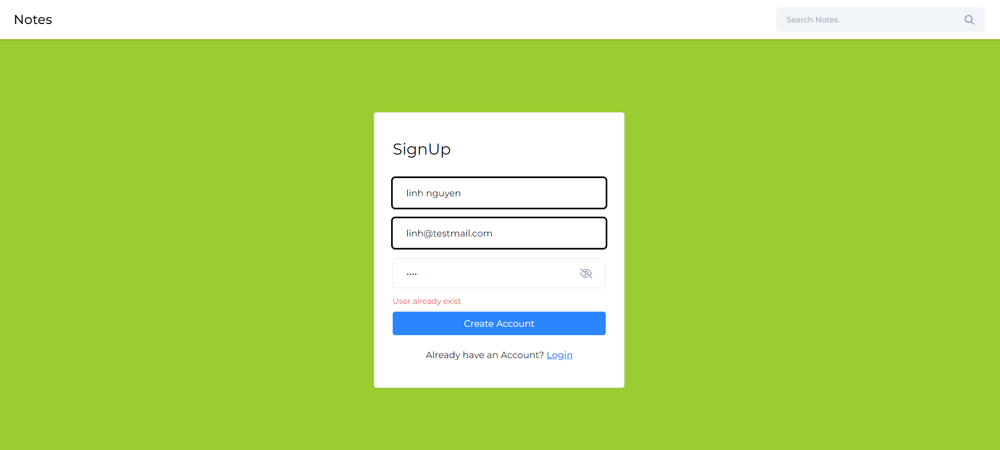
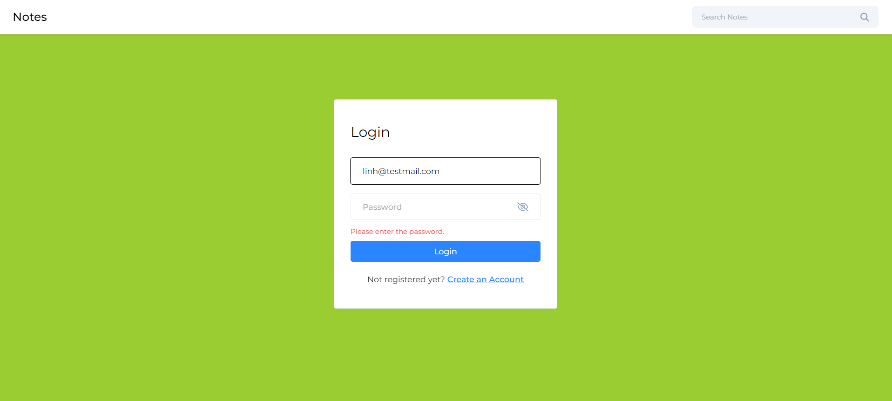
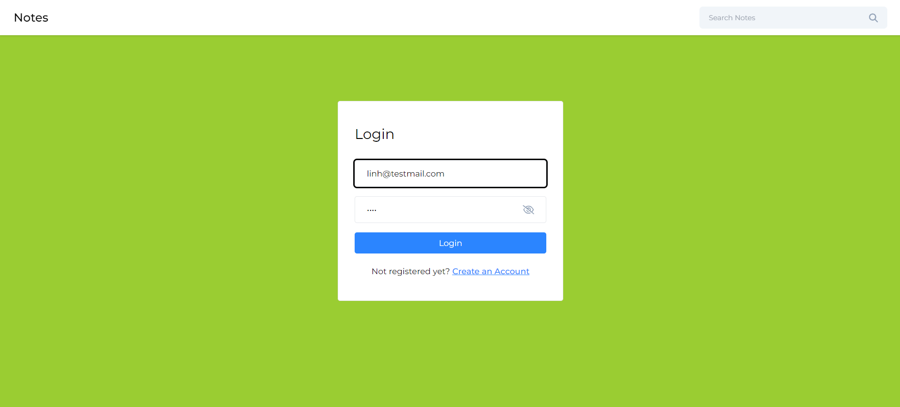
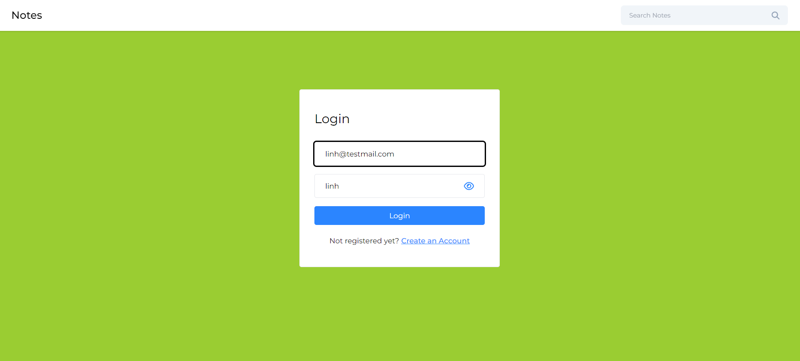

# Dashboard User
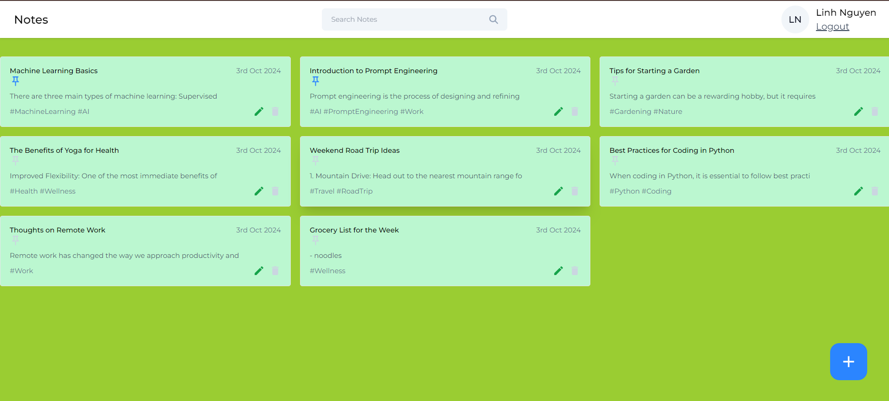
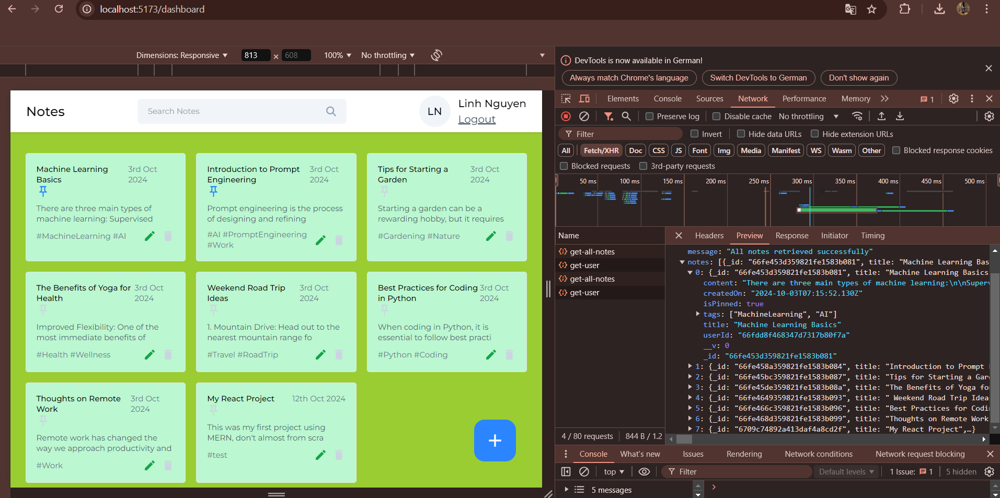

# Start first note
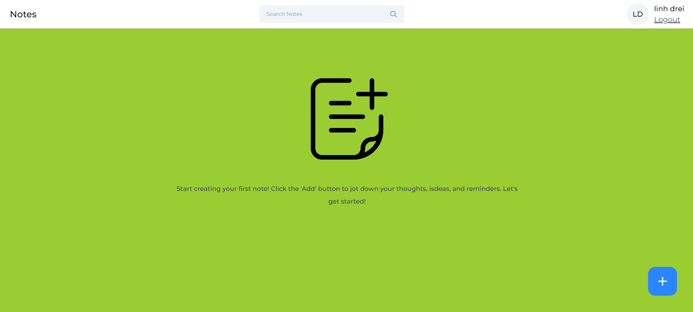

# AddEditNote & ToastMessage
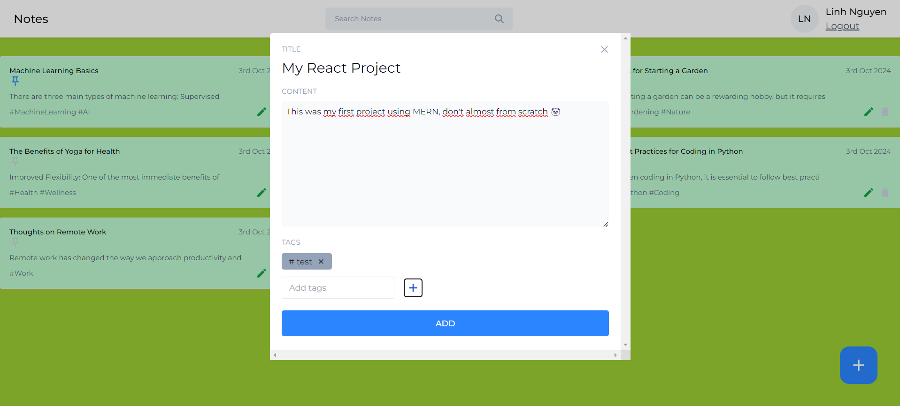
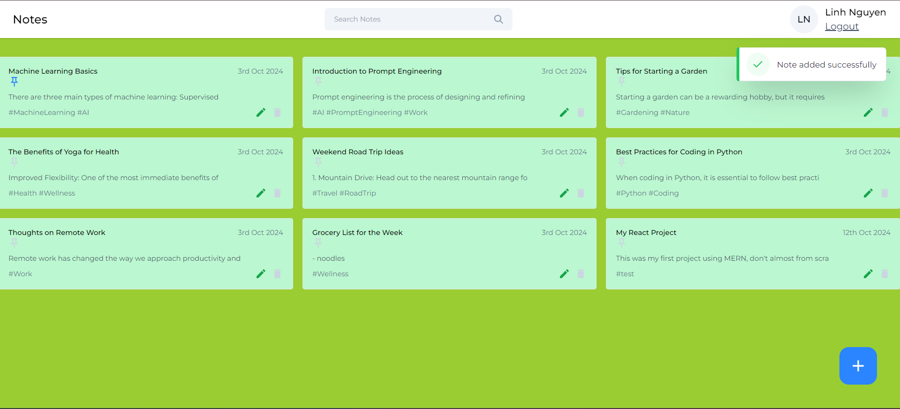
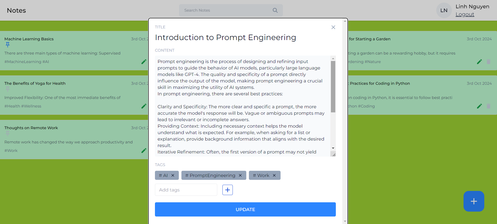
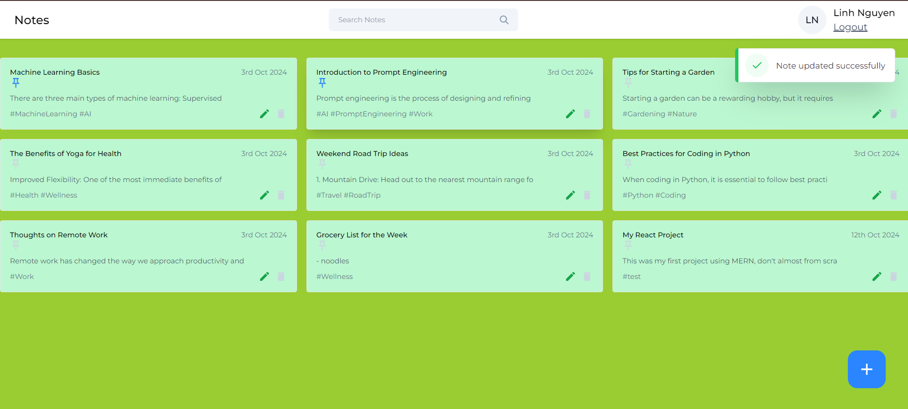
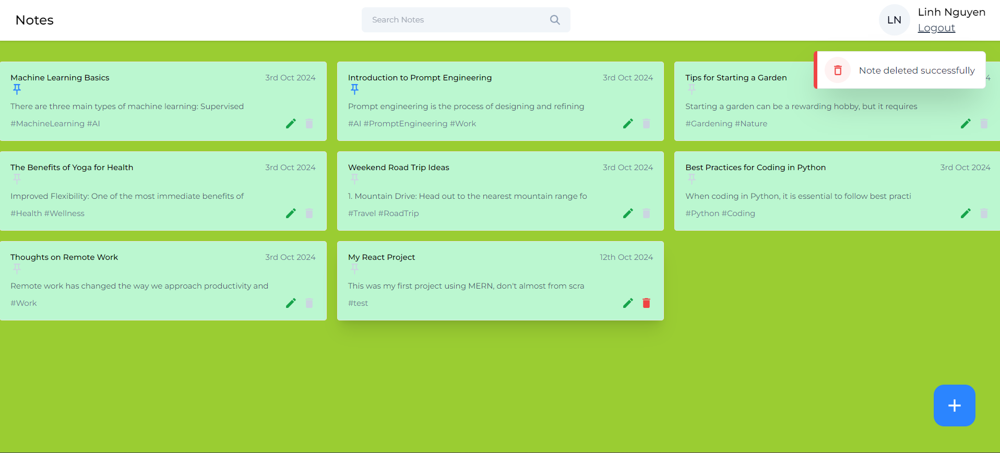

# Search

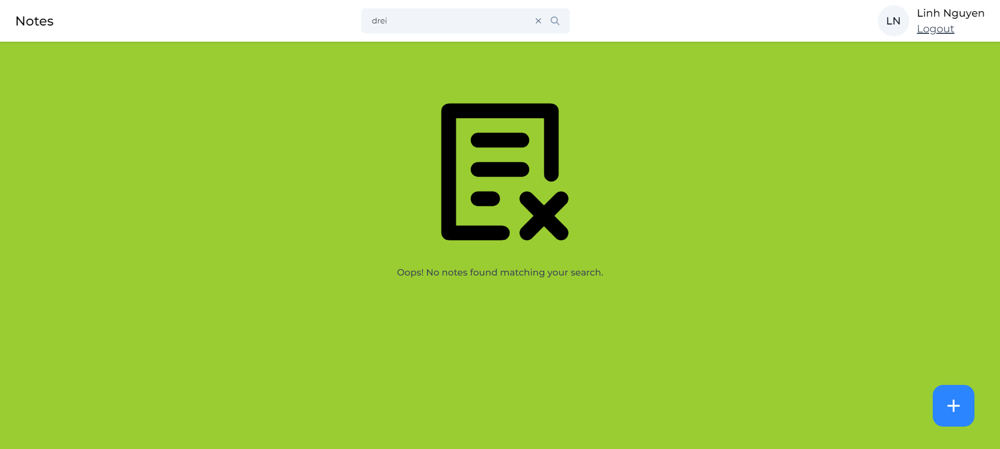

## Table of Contents

- [Project Setup](#project-setup)
  - [1. Create Project Structure](#1-create-project-structure)
  - [2. Backend Setup](#2-backend-setup)
  - [3. Frontend Setup](#3-frontend-setup)
  - [4. API Integration](#4-api-integration)
- [Key Dependencies](#key-dependencies)
- [Testing the Application](#testing-the-application)

## Project Setup

### 1. Create Project Structure

1. Create the project root directory:

   ```bash
   mkdir mern-notes-app
   cd mern-notes-app
   ```

2. Inside the root directory, create the `backend` and `frontend` folders:

   ```bash
   mkdir backend frontend
   ```

---

### 2. Backend Setup

1. **Navigate to the Backend Folder**:

   ```bash
   cd backend
   ```

2. **Initialize the Backend**:

   ```bash
   npm init -y
   ```

3. **Install Backend Dependencies**:

   ```bash
   npm install express mongoose bcryptjs jsonwebtoken dotenv cors
   ```

   - **express**: Web framework for Node.js.
   - **mongoose**: MongoDB object modeling tool.
   - **bcryptjs**: For hashing passwords.
   - **jsonwebtoken**: For creating JWT tokens.
   - **dotenv**: For environment variable management.
   - **cors**: Middleware for enabling CORS.

4. **Set Up the API in `index.js`**:

   Create an `index.js` file in the backend folder and set up your Express server:

   ```javascript
   const express = require('express');
   const mongoose = require('mongoose');
   const cors = require('cors');
   require('dotenv').config();

   ```

### 3. Frontend Setup

1. **Navigate to the Frontend Folder**:

   ```bash
   cd ../frontend
   ```

2. **Create React App with Vite**:

   ```bash
   npm create vite@latest
   ```


3. **Install Frontend Dependencies**:

   ```bash
   npm install axios react-router-dom react-icons
   ```

   - **axios**: For making HTTP requests to the backend API.
   - **react-router-dom**: For handling routing in your React application.
   - **react-icons**: For including icons in your UI.

---

## Key Dependencies

### Backend

- **express**: `npm install express`
- **mongoose**: `npm install mongoose`
- **bcryptjs**: `npm install bcryptjs`
- **jsonwebtoken**: `npm install jsonwebtoken`
- **dotenv**: `npm install dotenv`
- **cors**: `npm install cors`

### Frontend

- **axios**: `npm install axios`
- **react-router-dom**: `npm install react-router-dom`
- **react-icons**: `npm install react-icons`

---

